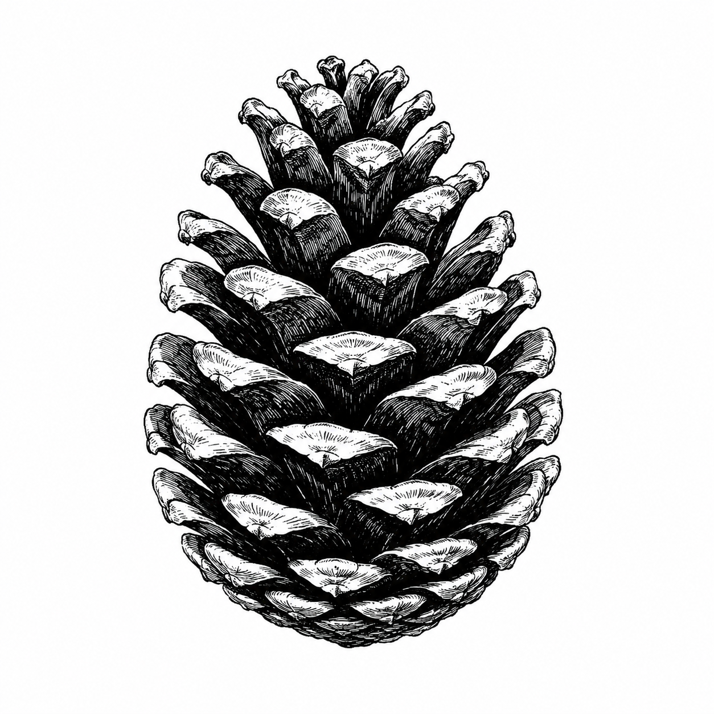

<p align="center">
  
</p>

# Babet

> *Babet*, n.m. — regional word from south-eastern France
> (Lyonnais, Forez, Dauphiné, Savoie, and adjacent Swiss
> Romandy) for a pine cone. Small, light, packed with seeds,
> and good for starting a fire — like this binary.

A standalone Lua 5.5 binary for Linux scripting and automation, written
in C++23. Embeds OpenSSL, SQLite, miniz, nlohmann/json, cpp-httplib,
and tomlplusplus statically — one binary, no system dependencies
beyond glibc.

Can be used in three modes:

1. **As a Lua interpreter** : `babet script.lua` or `babet folder/`
   (looks for `main.lua` inside).
2. **As a packager** : `babet --create-exe script.lua app` produces a
   self-contained executable with the script and its `require`d modules
   embedded as a ZIP appended to the binary.
3. **As a library of bindings** : Lua scripts get
   `babet.json`, `babet.http`, `babet.sqlite`,
   `babet.socket`, `babet.inotify`, `babet.workers`,
   `babet.user`, and more.

## Quick start

```sh
git clone https://github.com/Chipsterjulien/babet.git
cd babet
./build_local.sh        # downloads deps and compiles (~5 min first time)
./run_tests.sh          # offline harness — should print 890 PASS / 0 FAIL
./test/babet --help
```

The build script vendors and compiles all its dependencies. The only
prerequisites on your system are a C++23 compiler, CMake, `wget`, and
`unzip`.

## Documentation

- **English** : [`docs/en/README.md`](docs/en/README.md)
- **Français** : [`docs/fr/README.md`](docs/fr/README.md)

The docs are split per module under `docs/en/modules/` (and `docs/fr/`).
You can generate a single PDF manual with:

```sh
cd docs && make manual-en.pdf   # or manual-fr.pdf
```

Requires `pandoc` and a LaTeX engine (`texlive-xetex` is fine).

## Releases

Download prebuilt binaries from the
[releases page](https://github.com/Chipsterjulien/babet/releases).

## License

See [LICENSE](LICENSE).
